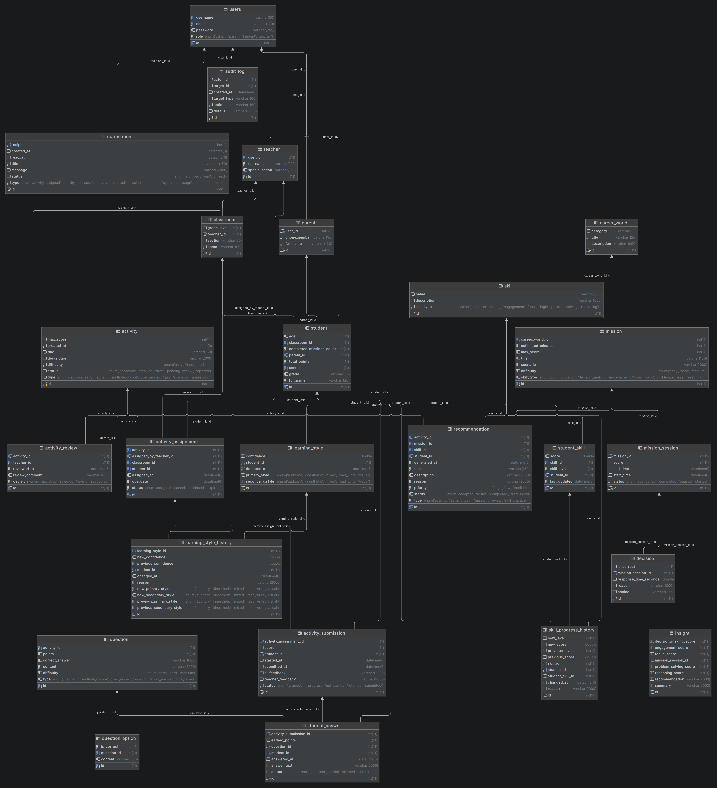
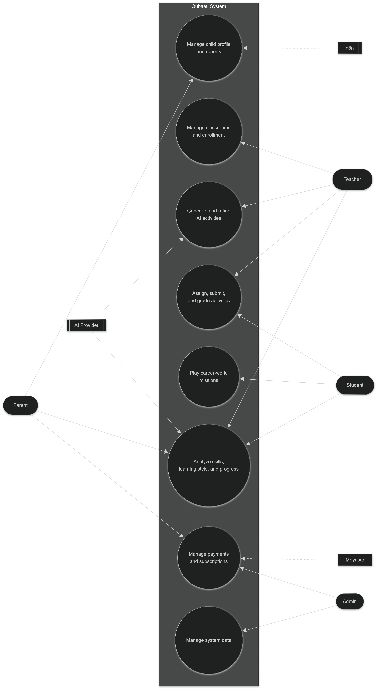

<h1 align="center">
  🎓 Qubaati | قبعتي
</h1>

  <b>AI-powered adaptive learning platform for children</b> 
  <b>منصة تعليمية ذكية وتفاعلية للأطفال مدعومة بالذكاء الاصطناعي</b>

---

## 📌 Project Summary

### العربية

**قبعتي** هي منصة تعليمية ذكية وتفاعلية للأطفال، تساعد الطلاب على التعلم من خلال عوالم مهنية افتراضية مثل الطب، الهندسة، العلوم، التعليم وغيرها. يدخل الطالب إلى هذه العوالم وينفذ مهام وأنشطة تفاعلية وأسئلة تعليمية مبنية على القرارات.

يقوم النظام بتحليل أداء الطالب وسلوكه التعليمي وسرعة اتخاذ القرار ونقاط القوة والضعف والمهارات ونمط التعلم. يستطيع المعلم إنشاء أنشطة باستخدام الذكاء الاصطناعي، تعديلها، اعتمادها، ثم تعيينها للطلاب أو الفصول. كما يستطيع ولي الأمر متابعة تقدم أبنائه من خلال لوحات تحكم وتقارير أسبوعية يتم إنشاؤها بمساعدة n8n والذكاء الاصطناعي.

هدف قبعاتي هو تقديم تجربة تعليمية أعمق من مجرد الدرجات، تساعد الطفل على اكتشاف مهاراته وميوله واهتماماته المستقبلية.

### English

**Qubaati** is an AI-assisted educational platform designed for children, teachers, and parents. Students explore interactive career worlds such as medicine, engineering, science, teaching, and more. Inside each world, they complete missions, activities, questions, and decision-based learning experiences.

The system analyzes student performance, learning behavior, decision speed, strengths, weaknesses, skills, and learning style. Teachers can generate and refine AI-powered activities, assign them to students or classrooms, review progress, and provide feedback. Parents can monitor their children’s progress through dashboards and AI/n8n-generated weekly reports.

The goal of Qubaati is to move beyond traditional grades and provide a deeper, personalized learning experience that helps children discover their interests, skills, and future career tendencies.

---

## ✨ Key Features

* 👨‍👩‍👧 **Parent flow**

  * Parent creates child account.
  * Parent views child progress, activity results, mission history, learning profile, and weekly reports.
  * Parent receives AI/n8n-generated weekly summaries.

* 👨‍🏫 **Teacher flow**

  * Teacher creates classrooms.
  * Teacher enrolls students into classrooms.
  * Teacher generates AI activities.
  * Teacher refines AI activities.
  * Teacher approves/rejects activities.
  * Teacher assigns activities to students or classrooms.
  * Teacher grades, reviews, reopens, and gives feedback.

* 👧 **Student flow**

  * Student starts assigned activities.
  * Student submits answers.
  * Student receives AI/system feedback.
  * Student plays missions inside career worlds.
  * Student receives recommendations.
  * Student skills and learning style are updated automatically.

* 🤖 **AI-powered learning**

  * AI activity generation.
  * AI activity refinement.
  * AI submission feedback.
  * AI answer grading.
  * AI teacher dashboard insight.
  * AI parent dashboard insight.
  * AI classroom summaries.
  * AI learning analysis.

* 💳 **Subscription and payments**

  * Moyasar checkout.
  * Parent and teacher subscriptions.
  * Subscription plans.
  * Payment callback, status, and receipt.

* 🔐 **Security**

  * HTTP Basic Auth.
  * `@AuthenticationPrincipal User user`.
  * Role-based authorization.
  * Service-layer ownership checks.
  * No path-variable IDs.
  * Body-based target IDs.
  * Thin controllers.

---

## 🛠️ Technologies and Tools Used

### Backend

| Technology            | Purpose                          |
| --------------------- | -------------------------------- |
| Java 17               | Main programming language        |
| Spring Boot 4.x       | Backend framework                |
| Spring Web            | REST API development             |
| Spring Data JPA       | Database access layer            |
| Hibernate             | ORM                              |
| MySQL                 | Relational database              |
| Spring Security       | Authentication and authorization |
| Basic Auth            | API authentication style         |
| BCrypt                | Password hashing                 |
| Spring Validation     | DTO validation                   |
| Lombok                | Boilerplate reduction            |
| ModelMapper           | Entity/DTO mapping               |
| Jackson               | JSON parsing and serialization   |
| Maven / Maven Wrapper | Build and dependency management  |

### AI and Automation

| Tool              | Purpose                                    |
| ----------------- | ------------------------------------------ |
| Spring AI         | AI integration layer                       |
| OpenAI ChatClient | AI activity generation/refinement/feedback |
| n8n               | Parent weekly report automation            |
| Webhooks          | Integration between Spring Boot and n8n    |

### Payments

| Tool               | Purpose                                         |
| ------------------ | ----------------------------------------------- |
| Moyasar            | Payment checkout, status, callback, and receipt |
| Subscription plans | Parent/teacher subscription management          |

### Development and Testing

| Tool                    | Purpose                       |
| ----------------------- | ----------------------------- |
| Postman                 | API testing collection        |
| Git / GitHub            | Version control               |
| IntelliJ IDEA           | Development environment       |
| Mermaid                 | README diagrams               |

---

### Roles

| Role      | Main Capabilities                                                      |
| --------- | ---------------------------------------------------------------------- |
| `ADMIN`   | Manage system data, generic CRUD, plans, worlds, missions, skills      |
| `TEACHER` | Manage classrooms, activities, assignments, grading, dashboards        |
| `PARENT`  | Create children, view child progress, reports, subscriptions           |
| `STUDENT` | Start assignments, submit answers, play missions, view recommendations |

---

## 🧩 Class Diagram

---

## 🎭 Use Case Diagram

---

## 🧠 AI Features

Qubaati uses AI to make learning more personalized.

| AI Feature                | Description                                             |
| ------------------------- | ------------------------------------------------------- |
| Activity generation       | Teacher generates activities using AI                   |
| Activity refinement       | Teacher refines an activity using instructions          |
| AI feedback               | Student receives personalized feedback after submission |
| AI grading support        | Free-text answers can be graded with AI support         |
| Parent dashboard insight  | Parent receives AI-powered child progress analysis      |
| Teacher dashboard insight | Teacher receives AI-powered classroom insights          |
| Classroom summary         | AI summarizes classroom performance                     |
| Mission recommendations   | Student receives learning recommendations               |

AI is implemented using **Spring AI ChatClient**.

---

## 💳 Payment and Subscription

The system integrates with **Moyasar** for payments.

| Feature  | Description                                   |
| -------- | --------------------------------------------- |
| Checkout | Authenticated user starts checkout            |
| Callback | Moyasar redirects/calls backend after payment |
| Status   | User checks payment status                    |
| Receipt  | User views payment receipt                    |
| Plans    | Parent/teacher subscription plans             |
| Limits   | Free/paid limits for children and classrooms  |

---

# 👨‍💻 My Contribution

| Module                             | Features                                                                            |
| ---------------------------------- | ----------------------------------------------------------------------------------- |
| 👨‍👩‍👧 Parent & Child Management | Create child accounts, list children, child overview, profile updates               |
| 🏫 Classroom Supervision           | Enroll students, remove students, list classroom students                           |
| 📊 Dashboards                      | Parent dashboard, teacher dashboard, classroom dashboard, student progress          |
| 🤖 AI Insights                     | Classroom AI summary, child learning summary, family dashboard insight              |
| 💳 Subscription & Payment          | Moyasar Sandbox checkout, payment verification, subscription activation and renewal |
| 🧾 Payment Receipt                 | Payment status lookup and full receipt generation                                   |
| 📧 Email Confirmation              | Branded HTML subscription-payment confirmation email                                |
| 🔐 Security                        | Basic Auth protection and payment ownership validation                              |
| 🧪 Testing                         | Controller, service, payment, subscription, security, and regression tests          |
| 🛠️ ModelMapper Fixes              | Safe relationship mapping to prevent DTO relation IDs from overwriting entity IDs   |

---

# 🔗 Git-Proven Endpoints I Implemented

> The following original profile-ID endpoints were implemented as part of my contribution. Some authenticated `/me` alternatives were added later by another team member.

## 👨‍👩‍👧 Parent & Child Management

| Method  | Endpoint                                                   | Description                                                  |
| ------- | ---------------------------------------------------------- | ------------------------------------------------------------ |
| `POST`  | `/api/v1/parents/{parentId}/children`                      | Create a child account linked to a parent                    |
| `GET`   | `/api/v1/parents/{parentId}/children`                      | List all children belonging to a parent                      |
| `GET`   | `/api/v1/parents/{parentId}/children/{studentId}/overview` | Get an overview of a specific child                          |
| `PATCH` | `/api/v1/parents/{parentId}/children/{studentId}/profile`  | Update a child profile, including name, age, and grade       |
| `GET`   | `/api/v1/parents/{parentId}/dashboard`                     | Get a parent dashboard with child cards and mission progress |

---

## 🏫 Classroom Supervision

| Method   | Endpoint                                                       | Description                               |
| -------- | -------------------------------------------------------------- | ----------------------------------------- |
| `POST`   | `/api/v1/classrooms/{classroomId}/students/{studentId}/enroll` | Enroll a student in a classroom           |
| `DELETE` | `/api/v1/classrooms/{classroomId}/students/{studentId}/remove` | Remove a student from a classroom         |
| `GET`    | `/api/v1/classrooms/{classroomId}/students`                    | List students enrolled in a classroom     |
| `GET`    | `/api/v1/classrooms/{classroomId}/dashboard`                   | Get a classroom dashboard summary         |
| `GET`    | `/api/v1/classrooms/{classroomId}/progress`                    | Get student-by-student classroom progress |

---

## 👩‍🏫 Teacher Dashboard

| Method | Endpoint                                 | Description                           |
| ------ | ---------------------------------------- | ------------------------------------- |
| `GET`  | `/api/v1/teachers/{teacherId}/dashboard` | Get a teacher-level dashboard summary |

---

## 🤖 AI Analysis & Insights

| Method | Endpoint                                                     | Description                                   |
| ------ | ------------------------------------------------------------ | --------------------------------------------- |
| `POST` | `/api/v1/ai/classrooms/{classroomId}/summary`                | Generate an AI classroom performance summary  |
| `POST` | `/api/v1/ai/parents/{parentId}/children/{studentId}/summary` | Generate an AI learning summary for a child   |
| `POST` | `/api/v1/ai/parents/{parentId}/dashboard-insight`            | Generate an AI family-level dashboard insight |

---

## 📚 Parent Child History

| Method | Endpoint                                                   | Description                                                          |
| ------ | ---------------------------------------------------------- | -------------------------------------------------------------------- |
| `GET`  | `/api/v1/parents/me/children/{studentId}/activity-results` | Get activity submission results for the authenticated parent’s child |
| `GET`  | `/api/v1/parents/me/children/{studentId}/mission-history`  | Get mission session history for the authenticated parent’s child     |

---

## 💳 Subscription & Payment APIs

| Method | Endpoint                                            | Description                                               |
| ------ | --------------------------------------------------- | --------------------------------------------------------- |
| `POST` | `/api/v1/payments/checkout`                         | Start an authenticated Moyasar payment checkout           |
| `GET`  | `/api/v1/payments/callback`                         | Verify Moyasar payment and activate or renew subscription |
| `GET`  | `/api/v1/payments/status`                           | Get payment status using the local payment reference      |
| `GET`  | `/api/v1/payments/receipt`                          | Get a complete payment receipt with ownership protection  |
| `GET`  | `/api/v1/subscriptions/plans`                       | List active subscription plans                            |
| `GET`  | `/api/v1/subscriptions/parents/{parentId}/status`   | Get parent subscription status                            |
| `GET`  | `/api/v1/subscriptions/teachers/{teacherId}/status` | Get teacher subscription status                           |

> The profile-ID subscription-status routes were later superseded by authenticated `/me` alternatives.

---

## ⚙️ Setup & Core Resources

| Method | Endpoint | Description |
| --- | --- | --- |
| `GET` | `/api/v1/activities/get-all` | List activities; used to initialize collection run variables. |
| `POST` | `/api/v1/teachers/add` | Create a teacher account. |
| `POST` | `/api/v1/parents/add` | Create a parent account. |
| `POST` | `/api/v1/classrooms/add` | Create a classroom. |
| `GET` | `/api/v1/classrooms/get-all` | List classrooms and capture a classroom ID. |
| `POST` | `/api/v1/parents/me/children` | Create a child for the authenticated parent. |
| `POST` | `/api/v1/activities/add` | Create a teacher-owned activity for the review flow. |

## 📝 Activity Review Flow

| Method | Endpoint | Description |
| --- | --- | --- |
| `PATCH` | `/api/v1/activities/approve` | Approve an activity through the review flow. |
| `POST` | `/api/v1/activities/details` | Return teacher activity details including questions and options. |
| `GET` | `/api/v1/activities/review-queue` | List activities waiting for review. |
| `POST` | `/api/v1/activities/review-history` | Return review history for an activity. |
| `PATCH` | `/api/v1/activities/request-revision` | Request changes to an activity. |
| `PATCH` | `/api/v1/activities/reject` | Reject an activity. |

## 👩‍🏫 Teacher & Parent Dashboard Flow

| Method | Endpoint | Description |
| --- | --- | --- |
| `GET` | `/api/v1/teachers/me/dashboard` | Return the authenticated teacher dashboard. |
| `POST` | `/api/v1/ai/teachers/me/dashboard-insight` | Generate an AI insight for the teacher dashboard. |
| `GET` | `/api/v1/teachers/me/classrooms` | List classrooms belonging to the authenticated teacher. |
| `GET` | `/api/v1/teachers/me/students` | List students available to the authenticated teacher. |
| `GET` | `/api/v1/teachers/me/activities` | List activities available to the authenticated teacher. |
| `GET` | `/api/v1/parents/me/children` | List children belonging to the authenticated parent. |
| `POST` | `/api/v1/parents/me/children/overview` | Return an overview for one of the authenticated parent’s children. |
| `POST` | `/api/v1/parents/me/children/learning-profile` | Return a child learning profile for the authenticated parent. |
| `POST` | `/api/v1/parents/me/children/activity-results` | Return child activity results without exposing correct answers. |
| `POST` | `/api/v1/parents/me/children/mission-history` | Return child mission history without internal decision details. |
| `POST` | `/api/v1/ai/classrooms/summary` | Generate an AI classroom summary. |
| `POST` | `/api/v1/ai/parents/children/summary` | Generate an AI learning summary for a child. |
| `POST` | `/api/v1/ai/parents/me/dashboard-insight` | Generate an AI family dashboard insight. |
| `GET` | `/api/v1/parents/me/dashboard` | Return the authenticated parent dashboard. |

## 💳 Subscription, Payment & Weekly Reports

| Method | Endpoint | Description |
| --- | --- | --- |
| `GET` | `/api/v1/subscriptions/parents/me/status` | Return the authenticated parent subscription status. |
| `GET` | `/api/v1/subscriptions/teachers/me/status` | Return the authenticated teacher subscription status. |
| `POST` | `/api/v1/parents/me/weekly-report/generate` | Generate a weekly report for the authenticated parent. |
| `POST` | `/api/v1/parents/weekly-reports/generate-all` | Generate weekly reports for all parents. |
| `GET` | `/api/v1/parents/me/weekly-reports` | List weekly reports for the authenticated parent. |
| `GET` | `/api/v1/parents/me/weekly-reports/latest` | Return the latest weekly report for the authenticated parent. |
| `POST` | `/api/v1/parents/weekly-reports/get` | Return a weekly report by ID. |

## 🔐 Security & Access-Control Checks

| Method | Endpoint | Description |
| --- | --- | --- |
| `GET` | `/api/v1/audit-logs/get-all` | List audit logs for an authorized admin. |
| `GET` | `/api/v1/users/me/notifications` | Security test: unauthenticated access should be rejected. |
| `POST` | `/api/v1/ai/activity-submissions/evaluate` | Security test: a parent must not evaluate a submission. |
| `POST` | `/api/v1/ai/activity-submissions/generate-feedback` | Security test: a student must not generate protected feedback. |
| `PATCH` | `/api/v1/recommendations/accept` | Security test: a student cannot accept another student’s recommendation. |
| `POST` | `/api/v1/activity-assignments/assign-student` | Security test: a parent cannot assign an activity. |

---

# 💳 Payment & Subscription Feature

The payment system was implemented using **Moyasar Sandbox** with secure backend verification.

### Main Features

* Parent Plus subscription for parents who need to add more children.
* Teacher Plus subscription for teachers who need to create more classrooms.
* Secure payment checkout with authenticated user identity.
* Backend-only verification with Moyasar after payment callback.
* Subscription activation after successful payment.
* Subscription renewal by extending the existing subscription end date.
* Idempotency protection to prevent repeated callbacks from activating a subscription twice.
* Local payment receipt generation.
* Ownership-protected payment status and receipt access.
* Branded HTML email confirmation after successful payment.

---

# 🤖 AI Features

### Classroom Summary

Generates a classroom-level learning summary based on student activity and progress.

### Child Learning Summary

Generates a parent-friendly summary of a child’s points, missions, strengths, concerns, and recommended actions.

### Family Dashboard Insight

Generates an AI insight that helps parents understand the overall learning progress of their children.

---

# 🔐 Security Features

* Stateless HTTP Basic Authentication.
* Authenticated payment checkout.
* Parent and teacher identity derived from the authenticated account.
* Payment status and receipt ownership validation.
* Public Moyasar callback endpoint for payment redirect handling.
* Custom authentication response to avoid browser Basic Auth popups in the local payment tester.

---

# 🧪 Testing & Quality

Focused tests were added for important business flows, including:

* Parent and classroom supervision endpoints.
* Teacher, parent, and classroom dashboard logic.
* Payment verification and callback handling.
* Subscription activation and renewal.
* Duplicate payment callback protection.
* Email failure safety without breaking payment activation.
* Payment ownership validation.
* ModelMapper regression protection for relationship ID mapping.
* Question mapping protection to ensure `activityId` never overwrites `Question.id`.

---

# 🛠️ Technologies Used

* Java
* Spring Boot
* Spring Data JPA
* Hibernate
* MariaDB / MySQL
* Spring Security
* Spring Mail
* OpenAI API
* Moyasar Sandbox API
* Maven
* JUnit 5
* Mockito

---

# 🎯 Key Achievement

Built the parent supervision, classroom monitoring, dashboards, AI insight, and subscription-payment layer of Qubaati.

The contribution includes secure Moyasar payment verification, subscription renewal, payment receipts, email confirmation, ownership protection, and AI-powered educational summaries for parents and teachers.
