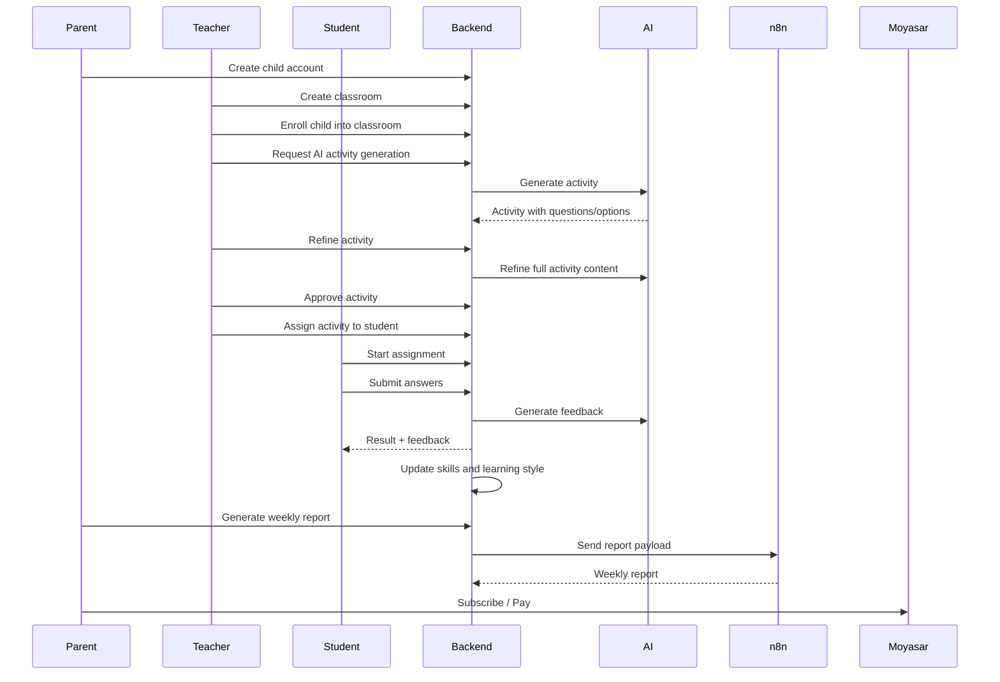

# 🎓 Qubaati System | نظام قبعاتي

<p align="center">
  <b>AI-powered adaptive learning platform for children</b><br/>
  <b>منصة تعليمية ذكية وتفاعلية للأطفال مدعومة بالذكاء الاصطناعي</b>
</p>

<p align="center">
  
  
  
  
  
  
  
</p>

---

## 📌 Project Summary

### العربية

**نظام قبعاتي** هو منصة تعليمية ذكية وتفاعلية للأطفال، تساعد الطلاب على التعلم من خلال عوالم مهنية افتراضية مثل الطب، الهندسة، العلوم، التعليم وغيرها. يدخل الطالب إلى هذه العوالم وينفذ مهام وأنشطة تفاعلية وأسئلة تعليمية مبنية على القرارات.

يقوم النظام بتحليل أداء الطالب وسلوكه التعليمي وسرعة اتخاذ القرار ونقاط القوة والضعف والمهارات ونمط التعلم. يستطيع المعلم إنشاء أنشطة باستخدام الذكاء الاصطناعي، تعديلها، اعتمادها، ثم تعيينها للطلاب أو الفصول. كما يستطيع ولي الأمر متابعة تقدم أبنائه من خلال لوحات تحكم وتقارير أسبوعية يتم إنشاؤها بمساعدة n8n والذكاء الاصطناعي.

هدف قبعاتي هو تقديم تجربة تعليمية أعمق من مجرد الدرجات، تساعد الطفل على اكتشاف مهاراته وميوله واهتماماته المستقبلية.


### English

**Qubaati System** is an AI-assisted educational platform designed for children, teachers, and parents. Students explore interactive career worlds such as medicine, engineering, science, teaching, and more. Inside each world, they complete missions, activities, questions, and decision-based learning experiences.

The system analyzes student performance, learning behavior, decision speed, strengths, weaknesses, skills, and learning style. Teachers can generate and refine AI-powered activities, assign them to students or classrooms, review progress, and provide feedback. Parents can monitor their children’s progress through dashboards and AI/n8n-generated weekly reports.

The goal of Qubaati is to move beyond traditional grades and provide a deeper, personalized learning experience that helps children discover their interests, skills, and future career tendencies.


---

## ✨ Key Features

* 👨‍👩‍👧 **Parent flow**

  * Parent creates child account.
  * Parent views child progress, activity results, mission history, learning profile, and weekly reports.
  * Parent receives AI/n8n-generated weekly summaries.

* 👨‍🏫 **Teacher flow**

  * Teacher creates classrooms.
  * Teacher enrolls students into classrooms.
  * Teacher generates AI activities.
  * Teacher refines AI activities.
  * Teacher approves/rejects activities.
  * Teacher assigns activities to students or classrooms.
  * Teacher grades, reviews, reopens, and gives feedback.

* 👧 **Student flow**

  * Student starts assigned activities.
  * Student submits answers.
  * Student receives AI/system feedback.
  * Student plays missions inside career worlds.
  * Student receives recommendations.
  * Student skills and learning style are updated automatically.

* 🤖 **AI-powered learning**

  * AI activity generation.
  * AI activity refinement.
  * AI submission feedback.
  * AI answer grading.
  * AI teacher dashboard insight.
  * AI parent dashboard insight.
  * AI classroom summaries.
  * AI learning analysis.

* 💳 **Subscription and payments**

  * Moyasar checkout.
  * Parent and teacher subscriptions.
  * Subscription plans.
  * Payment callback, status, and receipt.

* 🔐 **Security**

  * HTTP Basic Auth.
  * `@AuthenticationPrincipal User user`.
  * Role-based authorization.
  * Service-layer ownership checks.
  * No path-variable IDs.
  * Body-based target IDs.
  * Thin controllers.

---

## 🛠️ Technologies and Tools Used

### Backend

| Technology            | Purpose                          |
| --------------------- | -------------------------------- |
| Java 17               | Main programming language        |
| Spring Boot 4.x       | Backend framework                |
| Spring Web            | REST API development             |
| Spring Data JPA       | Database access layer            |
| Hibernate             | ORM                              |
| MySQL                 | Relational database              |
| Spring Security       | Authentication and authorization |
| Basic Auth            | API authentication style         |
| BCrypt                | Password hashing                 |
| Spring Validation     | DTO validation                   |
| Lombok                | Boilerplate reduction            |
| ModelMapper           | Entity/DTO mapping               |
| Jackson               | JSON parsing and serialization   |
| Maven / Maven Wrapper | Build and dependency management  |

### AI and Automation

| Tool              | Purpose                                    |
| ----------------- | ------------------------------------------ |
| Spring AI         | AI integration layer                       |
| OpenAI ChatClient | AI activity generation/refinement/feedback |
| n8n               | Parent weekly report automation            |
| Webhooks          | Integration between Spring Boot and n8n    |

### Payments

| Tool               | Purpose                                         |
| ------------------ | ----------------------------------------------- |
| Moyasar            | Payment checkout, status, callback, and receipt |
| Subscription plans | Parent/teacher subscription management          |

### Development and Testing

| Tool                    | Purpose                       |
| ----------------------- | ----------------------------- |
| Postman                 | API testing collection        |
| Git / GitHub            | Version control               |
| IntelliJ IDEA           | Development environment       |
| Mermaid                 | README diagrams               |

---


### Roles

| Role      | Main Capabilities                                                      |
| --------- | ---------------------------------------------------------------------- |
| `ADMIN`   | Manage system data, generic CRUD, plans, worlds, missions, skills      |
| `TEACHER` | Manage classrooms, activities, assignments, grading, dashboards        |
| `PARENT`  | Create children, view child progress, reports, subscriptions           |
| `STUDENT` | Start assignments, submit answers, play missions, view recommendations |

---

## 🧩 Class Diagram


---

## 🎭 Use Case Diagram


---

## 🧠 AI Features

Qubaati uses AI to make learning more personalized.

| AI Feature                | Description                                             |
| ------------------------- | ------------------------------------------------------- |
| Activity generation       | Teacher generates activities using AI                   |
| Activity refinement       | Teacher refines an activity using instructions          |
| AI feedback               | Student receives personalized feedback after submission |
| AI grading support        | Free-text answers can be graded with AI support         |
| Parent dashboard insight  | Parent receives AI-powered child progress analysis      |
| Teacher dashboard insight | Teacher receives AI-powered classroom insights          |
| Classroom summary         | AI summarizes classroom performance                     |
| Mission recommendations   | Student receives learning recommendations               |

AI is implemented using **Spring AI ChatClient**.

---

## 💳 Payment and Subscription

The system integrates with **Moyasar** for payments.

| Feature  | Description                                   |
| -------- | --------------------------------------------- |
| Checkout | Authenticated user starts checkout            |
| Callback | Moyasar redirects/calls backend after payment |
| Status   | User checks payment status                    |
| Receipt  | User views payment receipt                    |
| Plans    | Parent/teacher subscription plans             |
| Limits   | Free/paid limits for children and classrooms  |

Public payment endpoints:

```http
GET /api/v1/payments/callback
GET /api/v1/subscriptions/plans
```

Authenticated payment endpoints:

```http
POST /api/v1/payments/checkout
GET  /api/v1/payments/status
GET  /api/v1/payments/receipt
```

---

## 🔄 n8n Weekly Reports

Qubaati integrates with **n8n** to generate parent weekly reports.

Flow:

```text
Parent request
    ↓
Spring Boot backend
    ↓
n8n webhook
    ↓
Report generation
    ↓
Spring Boot saves report
    ↓
Parent views report
```

Main endpoints:

```http
POST /api/v1/parents/me/weekly-report/generate
GET  /api/v1/parents/me/weekly-reports
GET  /api/v1/parents/me/weekly-reports/latest
POST /api/v1/parents/weekly-reports/generate-all
```

---

## 📡 Non-CRUD Endpoint Catalog

This section lists the important business endpoints that are not simple CRUD.

> Note: The project follows a body-based ID style. Resource IDs such as `studentId`, `activityId`, `assignmentId`, and `submissionId` are sent in the request body, not in the URL path.

---

### 🔐 AI Endpoints

| Method | Endpoint                                            | Role          | Description                           |
| ------ | --------------------------------------------------- | ------------- | ------------------------------------- |
| `GET`  | `/api/v1/ai/health`                                 | Authenticated | Check AI provider status              |
| `POST` | `/api/v1/ai/activities/generate`                    | Teacher/Admin | Generate an activity using AI         |
| `POST` | `/api/v1/ai/activities/refine`                      | Teacher/Admin | Refine full activity content using AI |
| `POST` | `/api/v1/ai/activity-submissions/evaluate`          | Teacher/Admin | AI-evaluate a submission              |
| `POST` | `/api/v1/ai/activity-submissions/generate-feedback` | Teacher/Admin | Generate AI feedback for submission   |
| `POST` | `/api/v1/ai/classrooms/summary`                     | Teacher/Admin | Generate classroom AI summary         |
| `POST` | `/api/v1/ai/parents/me/dashboard-insight`           | Parent        | Generate parent dashboard insight     |
| `POST` | `/api/v1/ai/parents/me/children/summary`            | Parent        | Generate AI child summary             |
| `POST` | `/api/v1/ai/teachers/me/dashboard-insight`          | Teacher       | Generate teacher dashboard insight    |

---

### 👨‍👩‍👧 Parent Endpoints

| Method | Endpoint                                       | Role   | Description                             |
| ------ | ---------------------------------------------- | ------ | --------------------------------------- |
| `POST` | `/api/v1/parents/me/children`                  | Parent | Create child account                    |
| `GET`  | `/api/v1/parents/me/children`                  | Parent | List own children                       |
| `GET`  | `/api/v1/parents/me/dashboard`                 | Parent | Parent dashboard                        |
| `POST` | `/api/v1/parents/me/children/overview`         | Parent | View child overview                     |
| `POST` | `/api/v1/parents/me/children/learning-profile` | Parent | View child learning profile             |
| `POST` | `/api/v1/parents/me/children/activity-results` | Parent | View child activity results             |
| `POST` | `/api/v1/parents/me/children/mission-history`  | Parent | View child mission history              |
| `POST` | `/api/v1/parents/me/weekly-report/generate`    | Parent | Generate weekly report                  |
| `GET`  | `/api/v1/parents/me/weekly-reports`            | Parent | List weekly reports                     |
| `GET`  | `/api/v1/parents/me/weekly-reports/latest`     | Parent | Get latest weekly report                |
| `POST` | `/api/v1/parents/weekly-reports/generate-all`  | Admin  | Generate weekly reports for all parents |

---

### 👨‍🏫 Teacher Endpoints

| Method | Endpoint                         | Role    | Description        |
| ------ | -------------------------------- | ------- | ------------------ |
| `GET`  | `/api/v1/teachers/me/dashboard`  | Teacher | Teacher dashboard  |
| `GET`  | `/api/v1/teachers/me/classrooms` | Teacher | Teacher classrooms |
| `GET`  | `/api/v1/teachers/me/students`   | Teacher | Teacher students   |
| `GET`  | `/api/v1/teachers/me/activities` | Teacher | Teacher activities |

---

### 🏫 Classroom Endpoints

| Method | Endpoint                             | Role          | Description                   |
| ------ | ------------------------------------ | ------------- | ----------------------------- |
| `POST` | `/api/v1/classrooms/students/enroll` | Teacher/Admin | Enroll student into classroom |
| `POST` | `/api/v1/classrooms/students/remove` | Teacher/Admin | Remove student from classroom |
| `POST` | `/api/v1/classrooms/dashboard`       | Teacher/Admin | Classroom dashboard           |
| `POST` | `/api/v1/classrooms/progress`        | Teacher/Admin | Classroom progress            |

---

### 🧪 Activity Review and Assignment Endpoints

| Method | Endpoint                                        | Role          | Description                    |
| ------ | ----------------------------------------------- | ------------- | ------------------------------ |
| `POST` | `/api/v1/activities/approve`                    | Teacher/Admin | Approve activity               |
| `POST` | `/api/v1/activities/reject`                     | Teacher/Admin | Reject activity                |
| `POST` | `/api/v1/activities/request-revision`           | Teacher/Admin | Request activity revision      |
| `POST` | `/api/v1/activity-assignments/assign-student`   | Teacher/Admin | Assign activity to one student |
| `POST` | `/api/v1/activity-assignments/assign-classroom` | Teacher/Admin | Assign activity to classroom   |
| `POST` | `/api/v1/activity-assignments/bulk`             | Teacher/Admin | Bulk assign activity           |
| `POST` | `/api/v1/activity-assignments/by-activity`      | Teacher/Admin | List assignments by activity   |
| `POST` | `/api/v1/activity-assignments/cancel`           | Teacher/Admin | Cancel assignment              |
| `POST` | `/api/v1/activity-assignments/extend`           | Teacher/Admin | Extend assignment due date     |
| `POST` | `/api/v1/activity-assignments/expire-overdue`   | Teacher/Admin | Mark overdue assignments       |
| `POST` | `/api/v1/activity-assignments/due-soon`         | Teacher/Admin | Send due-soon notifications    |

---

### 📝 Activity Submission Endpoints

| Method | Endpoint                                         | Role          | Description                      |
| ------ | ------------------------------------------------ | ------------- | -------------------------------- |
| `POST` | `/api/v1/activity-assignments/start`             | Student/Admin | Start assignment                 |
| `POST` | `/api/v1/activity-submissions/submit`            | Student/Admin | Submit assignment                |
| `POST` | `/api/v1/activity-submissions/result`            | Student/Admin | View submission result           |
| `POST` | `/api/v1/activity-submissions/current`           | Student/Admin | View current submission          |
| `POST` | `/api/v1/activity-submissions/feedback`          | Student/Admin | View submission feedback         |
| `POST` | `/api/v1/activity-submissions/by-activity`       | Teacher/Admin | List submissions by activity     |
| `POST` | `/api/v1/activity-submissions/teacher-details`   | Teacher/Admin | View teacher submission details  |
| `POST` | `/api/v1/activity-submissions/teacher-feedback`  | Teacher/Admin | Add teacher feedback             |
| `POST` | `/api/v1/activity-submissions/return-to-student` | Teacher/Admin | Return submission to student     |
| `POST` | `/api/v1/activity-submissions/reopen`            | Teacher/Admin | Reopen submission                |
| `POST` | `/api/v1/activity-submissions/pending-grading`   | Teacher/Admin | List pending grading submissions |

---

### ✍️ Student Answer Endpoints

| Method  | Endpoint                        | Role          | Description           |
| ------- | ------------------------------- | ------------- | --------------------- |
| `POST`  | `/api/v1/student-answers/batch` | Student/Admin | Save batch answers    |
| `PATCH` | `/api/v1/student-answers/grade` | Teacher/Admin | Manually grade answer |

---

### 👧 Student Self-Service Endpoints

| Method | Endpoint                                         | Role    | Description                |
| ------ | ------------------------------------------------ | ------- | -------------------------- |
| `GET`  | `/api/v1/students/me`                            | Student | Student profile            |
| `GET`  | `/api/v1/students/me/activity-dashboard`         | Student | Student activity dashboard |
| `GET`  | `/api/v1/students/me/career-worlds/available`    | Student | Available career worlds    |
| `GET`  | `/api/v1/students/me/missions/available`         | Student | Available missions         |
| `GET`  | `/api/v1/students/me/recommendations`            | Student | Student recommendations    |
| `POST` | `/api/v1/students/me/recommendations/regenerate` | Student | Regenerate recommendations |
| `GET`  | `/api/v1/students/me/skills`                     | Student | Student skills             |

---

### 🎮 Mission Flow Endpoints

| Method   | Endpoint                                      | Role          | Description                 |
| -------- | --------------------------------------------- | ------------- | --------------------------- |
| `POST`   | `/api/v1/mission-sessions/start`              | Student/Admin | Start mission session       |
| `POST`   | `/api/v1/mission-sessions/decision`           | Student/Admin | Submit mission decision     |
| `POST`   | `/api/v1/mission-sessions/complete`           | Student/Admin | Complete mission session    |
| `POST`   | `/api/v1/mission-sessions/current`            | Student/Admin | Get current mission session |
| `POST`   | `/api/v1/mission-sessions/insight/regenerate` | Student/Admin | Regenerate mission insight  |
| `POST`   | `/api/v1/missions/steps/batch`                | Admin         | Add mission steps in batch  |
| `POST`   | `/api/v1/missions/steps/get`                  | Admin         | Get mission steps           |
| `DELETE` | `/api/v1/missions/steps/delete`               | Admin         | Delete mission steps        |

---

### 💡 Recommendation and Notification Endpoints

| Method | Endpoint                                  | Role          | Description                    |
| ------ | ----------------------------------------- | ------------- | ------------------------------ |
| `POST` | `/api/v1/recommendations/accept`          | Student/Admin | Accept recommendation          |
| `POST` | `/api/v1/recommendations/dismiss`         | Student/Admin | Dismiss recommendation         |
| `POST` | `/api/v1/recommendations/complete`        | Student/Admin | Complete recommendation        |
| `GET`  | `/api/v1/users/me/notifications`          | Authenticated | Get user notifications         |
| `GET`  | `/api/v1/users/me/notifications/unread`   | Authenticated | Get unread notifications       |
| `POST` | `/api/v1/users/me/notifications/read`     | Authenticated | Mark notification as read      |
| `POST` | `/api/v1/users/me/notifications/read-all` | Authenticated | Mark all notifications as read |

---

### 💳 Payment and Subscription Endpoints

| Method | Endpoint                                   | Role          | Description                 |
| ------ | ------------------------------------------ | ------------- | --------------------------- |
| `POST` | `/api/v1/payments/checkout`                | Authenticated | Start Moyasar checkout      |
| `GET`  | `/api/v1/payments/callback`                | Public        | Moyasar payment callback    |
| `GET`  | `/api/v1/payments/status`                  | Authenticated | Get payment status          |
| `GET`  | `/api/v1/payments/receipt`                 | Authenticated | Get payment receipt         |
| `GET`  | `/api/v1/subscriptions/plans`              | Public        | List subscription plans     |
| `GET`  | `/api/v1/subscriptions/parents/me/status`  | Parent        | Parent subscription status  |
| `GET`  | `/api/v1/subscriptions/teachers/me/status` | Teacher       | Teacher subscription status |

---

## 🚀 How to Run Locally

### 1. Clone the repository

```bash
git clone https://github.com/YOUR_USERNAME/qubaati-system.git
cd qubaati-system
```

### 2. Configure MySQL

Create a database:

```sql
CREATE DATABASE qubaati;
```

### 3. Configure environment variables

Set your database, AI, Moyasar, and n8n values.

Example:

```bash
export DB_USERNAME=root
export DB_PASSWORD=your_password
export OPENAI_API_KEY=your_openai_key
```

### 4. Build the project

```bash
./mvnw clean compile
```

On Windows:

```bash
mvnw.cmd clean compile
```

### 5. Run the project

```bash
./mvnw spring-boot:run
```

On Windows:

```bash
mvnw.cmd spring-boot:run
```

The backend will run on:

```text
http://localhost:8080
```

---

## 🧪 API Testing

The project includes a Postman collection.

Current API testing standards:

* Each request uses role-specific Basic Auth.
* No path variables are used.
* IDs are sent in request bodies.
* No actor IDs are accepted from the body.
* Parent/teacher/student identity comes from Basic Auth.
* Postman lint validates route correctness.

Run the Postman collection in this order:

```text
01 - Setup / Seed
02 - AI Activity Generation
03 - Activity Review
04 - Classroom and Enrollment
05 - Assignment
06 - Student Submission
07 - Grading and Feedback
08 - Mission Flow
09 - Short Answer / AI Grading
10 - Dashboards
11 - Parent Reports
12 - Payments / Subscriptions
13 - n8n Weekly Reports
14 - Security Negative Tests
```

---

## 🧭 Main Business Flow



---

## 🤍 Acknowledgment

Qubaati was built as an educational backend system to explore how AI, gamification, learning analytics, and secure backend design can improve personalized education for children.

> "Learning is not only about grades — it is about discovering potential."
